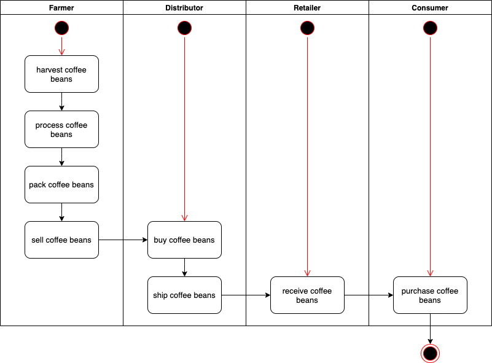
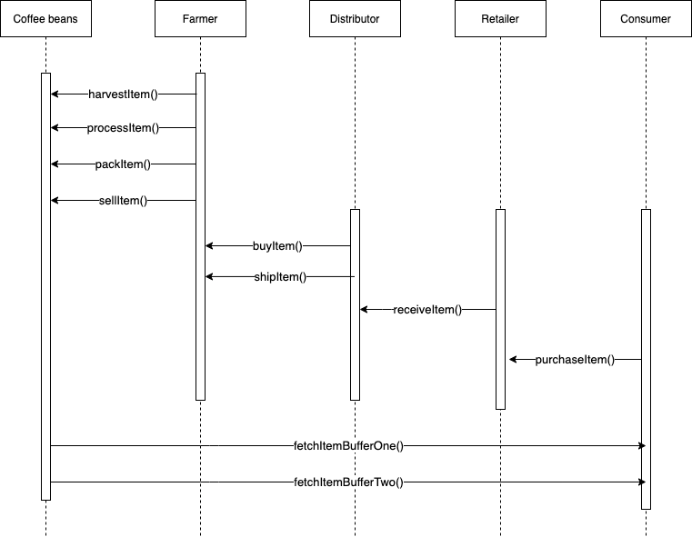
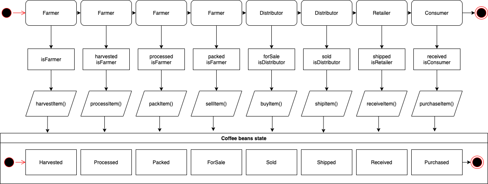
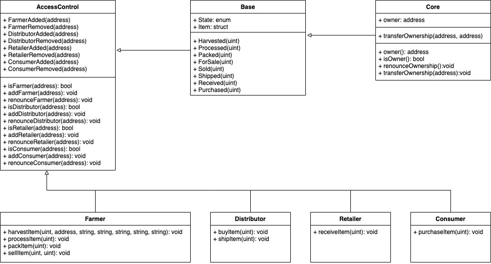

# Ethereum Dapp for Tracking Items through Supply Chain

This repository containts an Ethereum DApp that demonstrates a Supply Chain flow between a Seller and Buyer. It's based on this template: https://github.com/udacity/nd1309-Project-6b-Example-Template

### Prerequisites

Some extra packages/libraries were required during development:

-   truffle-assertions: I decided to use because it's easier asserting whether an event was emmited.
-   truffle-hdwallet-provider: required for deploying contracts to Rinkeby network.

You can see all these dependencies in package.json file.

### Installing

Clone this repository:

```
git clone https://github.com/agilalva/supplychain-dapp.git
```

Install all requisite npm packages (as listed in `package.json`):

```
npm install
```

In my case I used the truffle console and the ganache application. In the `Accounts & Keys` settings you can set the mnemonic. As stated in the template, you can also use the ganache-cli. Either way the mnemonic should be as follows:

```
spirit supply whale amount human item harsh scare congress discover talent hamster
```

## Built With

-   Truffle v5.4.0 (core: 5.4.0)
-   Solidity - 0.4.24 (solc-js)
-   Node v16.4.2
-   Web3.js ([v0.20.6](https://github.com/ChainSafe/web3.js/blob/v0.20.6/dist/web3.min.js))

## Contract deployment

The `SupplyChain.sol` contract was deployed on the Rinkeby network successfully:

-   Transaction: [0x680bc418e823a045b773b549209cf71ec33f9adb2b2d7661e838291d190b5ef1](https://rinkeby.etherscan.io/tx/0x680bc418e823a045b773b549209cf71ec33f9adb2b2d7661e838291d190b5ef1)
-   Contract: [0x3c8b58B99CAee8Ed1070ad2D6C4d3431C7ed540e](https://rinkeby.etherscan.io/address/0x3c8b58B99CAee8Ed1070ad2D6C4d3431C7ed540e)

## Diagrams

### Activity



### Sequence



### State



### Class


